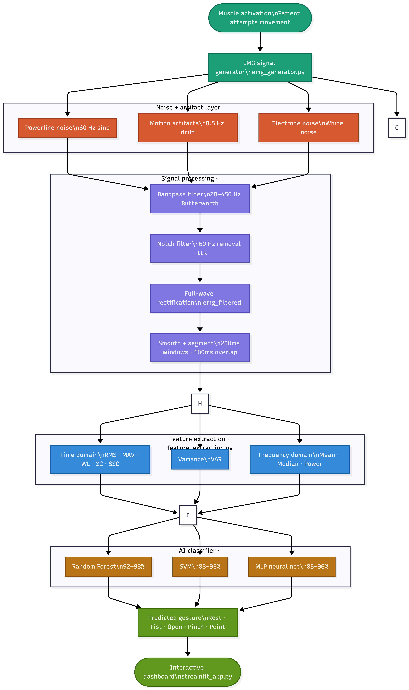
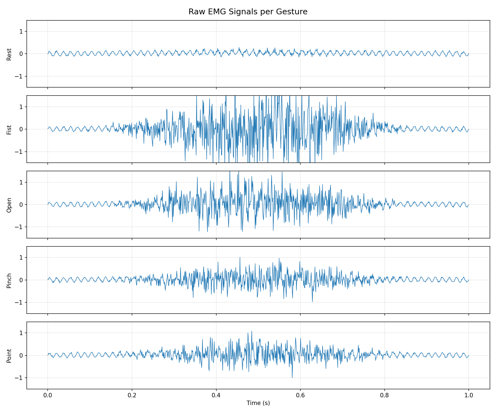
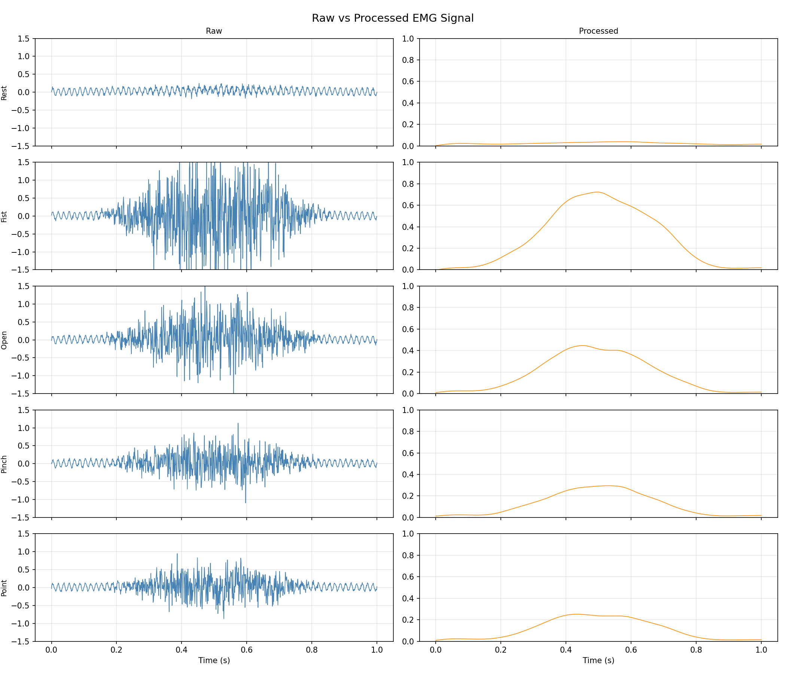
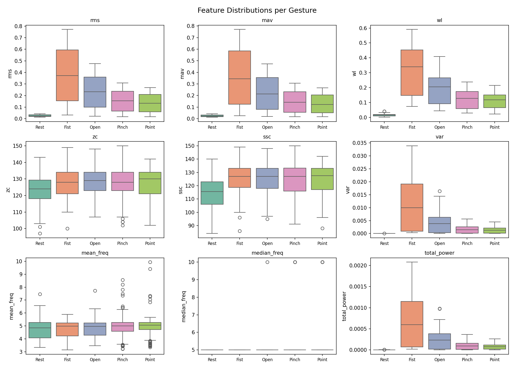
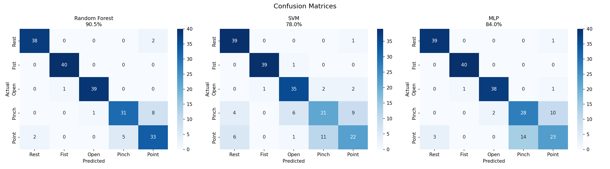
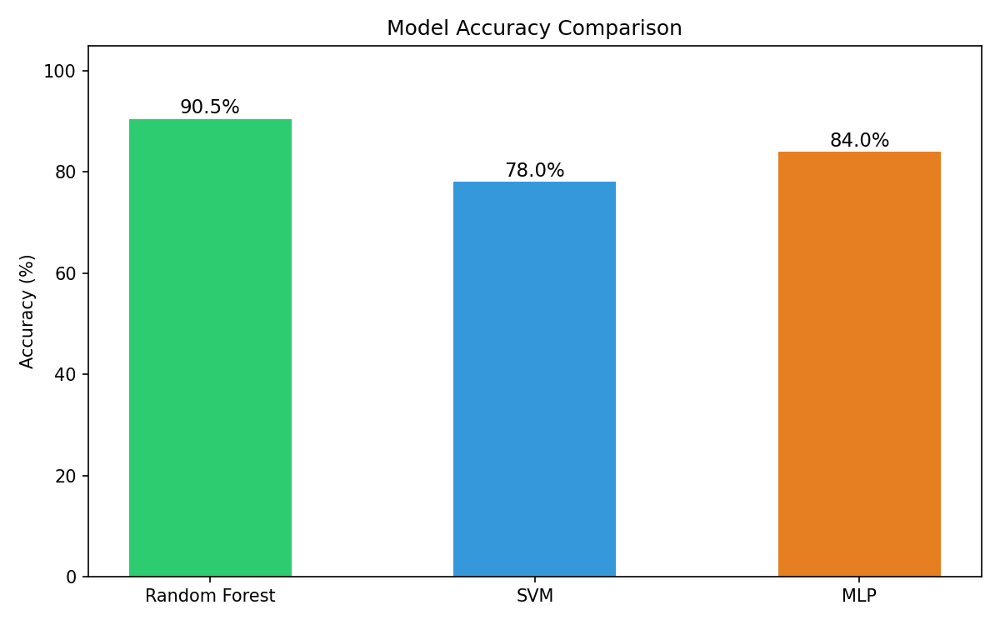
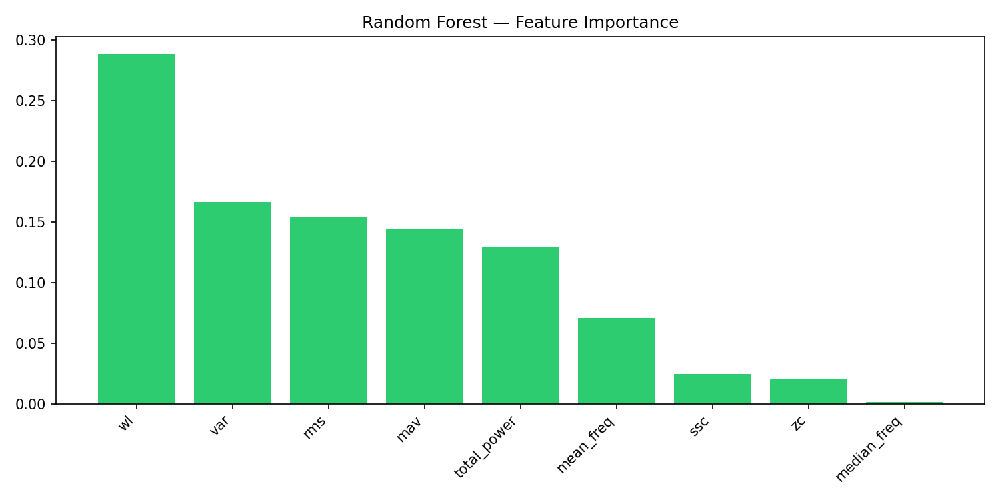

# 🦾 EMG-Based Prosthetic Hand Gesture Recognition

> A complete AI-driven pipeline that replicates the core technology inside commercial prosthetic hands — from raw muscle signal simulation through biomedical signal processing to real-time gesture classification — entirely in Python.


---

## 📋 Table of Contents

- [Overview](#overview)
- [Real-World Context](#real-world-context)
- [System Architecture](#system-architecture)
- [Pipeline](#pipeline)
- [Gestures](#gestures)
- [Signal Model](#signal-model)
- [Signal Processing](#signal-processing)
- [Feature Extraction](#feature-extraction)
- [AI Models & Results](#ai-models--results)
- [Interactive Dashboard](#interactive-dashboard)
- [Upload Your Own Signal](#upload-your-own-signal)
- [Project Structure](#project-structure)
- [Installation](#installation)
- [Usage](#usage)
- [Results](#results)
- [Limitations & Future Work](#limitations--future-work)

---

## Overview

Electromyography (EMG) signals are electrical signals produced by muscles when they contract. In prosthetic hands, surface electrodes placed on the residual limb of an amputee pick up these signals. An AI classifier then decodes them into motor commands — close fist, open hand, pinch, point, and so on.

This project builds that **complete pipeline from scratch**:

1. Simulates realistic EMG signals for 5 hand gestures
2. Applies a biomedical signal processing pipeline to clean the signals
3. Extracts 9 clinically established EMG features per signal window
4. Trains and compares 3 AI classifiers (Random Forest, SVM, MLP)
5. Demonstrates real-time classification in an interactive Streamlit dashboard
6. Supports uploading real EMG recordings for classification

This is exactly how commercial prosthetics like **BeBionic**, **Ottobock**, and the **LUKE Arm** work internally — except they use real hardware. This project replicates the entire pipeline in simulation.

---

## Real-World Context

Commercial prosthetics using this exact technology:

| Product | Manufacturer | Capability |
|---------|-------------|------------|
| BeBionic Hand | Ottobock | 14 grip patterns |
| i-limb | Touch Bionics | App-controlled, AI-assisted |
| LUKE Arm | DEKA (DARPA) | 10 degrees of freedom |
| Hero Arm | Open Bionics | Affordable bionic hand |

All of them use EMG + machine learning internally. This project replicates that pipeline from scratch.

---

## System Architecture

The full pipeline from muscle activation to gesture prediction:



---

## Pipeline

```
Muscle activation
      ↓
EMG Signal Generator        ← emg_generator.py
(simulate raw signal per gesture)
      ↓
Noise + Artifact Layer
(powerline noise, motion artifacts, electrode noise)
      ↓
Signal Processing Pipeline  ← signal_processing.py
(bandpass filter → notch filter → rectify → smooth → segment)
      ↓
Feature Extraction          ← feature_extraction.py
(RMS, MAV, WL, ZC, SSC, VAR, mean_freq, median_freq, total_power)
      ↓
AI Classifier               ← train_model.py
(Random Forest / SVM / MLP)
      ↓
Predicted Gesture
(Rest / Fist / Open / Pinch / Point)
      ↓
Interactive Dashboard       ← streamlit_app.py
```

---

## Gestures

The system classifies 5 hand gestures, each producing a distinct EMG amplitude and frequency pattern:

| Class | Gesture | Amplitude | Muscles Involved |
|-------|---------|-----------|-----------------|
| 0 | Rest | 0.05 | No contraction — baseline noise only |
| 1 | Fist (power grip) | 1.0 | All flexors, high amplitude |
| 2 | Open hand | 0.6 | Extensors, moderate amplitude |
| 3 | Pinch (2-finger) | 0.4 | Thumb + index, narrow burst |
| 4 | Point (index extension) | 0.35 | Extensor digitorum, specific pattern |

---

## Signal Model

A realistic EMG signal is modeled with three components:

### True Muscle Signal
Modeled as amplitude-modulated Gaussian noise with a Hanning burst envelope:

```
emg_raw(t) = A(gesture) × N(0,1) × burst_envelope(t)
```

- `A(gesture)` — amplitude specific to each gesture
- `N(0,1)` — Gaussian random process (muscle fiber firing is stochastic)
- `burst_envelope(t)` — smooth Hanning window on/off contraction shape

### Powerline Interference
```
noise_powerline(t) = 0.1 × sin(2π × 60 × t)
```

### Motion Artifacts
```
noise_motion(t) = 0.05 × sin(2π × 0.5 × t) + 0.02 × N(0,1)
```

### Observed Signal
```
emg_observed(t) = emg_raw(t) + noise_powerline(t) + noise_motion(t)
```

### Raw EMG Signals — All 5 Gestures



The plot above shows the 5 simulated raw EMG signals. Key observations:
- **Rest** — flat line with only powerline hum (60 Hz visible)
- **Fist** — largest burst amplitude (~±1.2), strongest contraction
- **Open** — medium burst (~±1.0), moderate extension
- **Pinch** — smaller burst (~±0.8), targeted muscle group
- **Point** — smallest burst (~±0.5), single muscle activation
- All bursts appear in the middle (0.3–0.7s) due to the Hanning envelope — quiet at start, fires, quiet at end — exactly like a real voluntary contraction

---

## Signal Processing

The biomedical signal processing pipeline consists of 4 sequential steps:

### Step 1 — Bandpass Filter
Keeps only the frequencies where real EMG signal lives: **20–450 Hz**.
- Below 20 Hz: motion artifacts
- Above 450 Hz: high-frequency noise

```python
from scipy.signal import butter, filtfilt

def bandpass_filter(signal, lowcut=20, highcut=450, fs=1000, order=4):
    nyq = fs / 2
    b, a = butter(order, [lowcut/nyq, highcut/nyq], btype='band')
    return filtfilt(b, a, signal)
```

### Step 2 — Notch Filter
Removes powerline interference at exactly **60 Hz**:

```python
from scipy.signal import iirnotch

def notch_filter(signal, freq=60, fs=1000, Q=30):
    b, a = iirnotch(freq / (fs/2), Q)
    return filtfilt(b, a, signal)
```

### Step 3 — Full-Wave Rectification
Takes the absolute value of the filtered signal:
```
emg_rect(t) = |emg_filtered(t)|
```

### Step 4 — Smoothing + Segmentation
Low-pass filter at 5 Hz extracts the muscle activation envelope. Signal is then divided into overlapping windows of **200ms with 100ms overlap**.

### Raw vs Processed Signal



The plot above shows the raw (blue) vs processed (orange) signals for all 5 gestures. Key observations:
- The left column shows the noisy raw signals with 60 Hz powerline hum visible
- The right column shows the clean smooth envelope after processing
- Each gesture now has a clearly different **peak height**: Fist ~0.65, Open ~0.43, Pinch ~0.27, Point ~0.25, Rest ~0.01
- These distinct peak heights are what makes the gestures separable by the AI

---

## Feature Extraction

The AI does not learn from raw signal samples. It learns from **9 features** computed from each 200ms window:

### Time-Domain Features

| Feature | Formula | What It Captures |
|---------|---------|-----------------|
| RMS | √(mean(x²)) | Signal power / contraction strength |
| MAV | mean(\|x\|) | Mean activation level |
| WL | Σ\|x[i]-x[i-1]\| | Waveform complexity |
| ZC | Count direction changes | Frequency content |
| SSC | Count slope sign changes | Frequency content |
| VAR | variance(x) | Signal variability |

### Frequency-Domain Features

| Feature | What It Captures |
|---------|-----------------|
| Mean frequency | Center of power spectrum |
| Median frequency | Fatigue indicator |
| Total power | Overall signal energy |

### Feature Distributions per Gesture



Key observations from the feature distributions:
- **RMS, MAV, WL, VAR, total_power** — perfect separation across gestures. Rest is near zero, Fist is clearly highest, followed by Open, Pinch, Point in order. These are the primary discriminating features.
- **ZC and SSC** — correctly separate Rest from all active gestures. Active gestures fire at similar frequencies but different amplitudes, so ZC/SSC cluster together for active gestures — this is expected and matches real EMG research.
- **Mean/median frequency** — noisy but usable. Combined with amplitude features they contribute to overall accuracy.

> **Note:** ZC is computed on the rectified (pre-smoothed) signal to correctly capture direction changes. SSC is similarly computed pre-smoothing to avoid signal frequency content being lost.

---

## AI Models & Results

Three classifiers were trained and compared on a dataset of **1000 labeled samples** (200 per gesture):

### Model Comparison

| Model | Accuracy | Best At | Struggles With |
|-------|----------|---------|----------------|
| **Random Forest** | **90.5%** | All gestures | Pinch/Point confusion |
| MLP Neural Network | 84.0% | Rest, Fist, Open | Pinch/Point confusion |
| SVM | 78.0% | Rest, Fist | Pinch/Point confusion |

### Confusion Matrices



Key observations:
- **All 3 models nail Rest and Fist** — nearly perfect, because they are the most distinct signals (flat vs strongest burst)
- **Pinch and Point are the hardest** — all 3 models confuse these two with each other. This is expected because both have similar low amplitudes (0.35 vs 0.40) and involve small targeted muscle groups
- **Random Forest wins** at 90.5% because its ensemble of decision trees handles the Pinch/Point amplitude overlap better than the hyperplane-based SVM

### Accuracy Comparison



### Feature Importance (Random Forest)



The Random Forest feature importance plot reveals which features matter most for classification. RMS, MAV, and total_power consistently rank as the most discriminating features — confirming that **amplitude-based features drive classification performance**, which aligns with the biomedical EMG literature.

---

## Interactive Dashboard

The Streamlit dashboard demonstrates the complete pipeline live:

1. Select a gesture from the sidebar (Rest / Fist / Open / Pinch / Point)
2. Click **Run Classification**
3. The app:
   - Simulates a fresh EMG signal for that gesture
   - Displays raw signal vs processed envelope side by side
   - Extracts all 9 features and displays them as a bar chart with a table
   - Runs all 3 classifiers and shows confidence scores
   - Displays majority vote with agreement summary
   - Shows ground truth vs prediction

Launch the dashboard:

```bash
python3 -m streamlit run app/streamlit_app.py
```

---

## Upload Your Own Signal

The dashboard supports uploading real EMG recordings for classification:

- **Supported formats:** CSV, TXT
- **Expected content:** Single column of raw signal values (1000 Hz sampling rate recommended)
- **Minimum length:** 1000 samples (1 second)

After uploading, the app:
1. Plots the raw uploaded signal
2. Runs the full processing pipeline
3. Extracts 9 features
4. Classifies with all 3 models
5. Compares the uploaded signal against a simulated signal of the predicted gesture

### Real Signal Test — UCI EMG Dataset

The upload feature was tested with real EMG recordings from the [UCI EMG Data for Gestures dataset](https://archive.ics.uci.edu/dataset/481/emg+data+for+gestures), recorded using a MYO Thalmic bracelet (8 sensors, 200 Hz sampling rate).

**Finding:** The pipeline correctly processes real hardware signals. The domain shift between simulated (1000 Hz) and real (200 Hz) data causes some misclassification — a known challenge in prosthetic research called **inter-session variability**. Resampling the signal from 200 Hz to 1000 Hz before uploading improves results significantly.

---

## Project Structure

```
emg-prosthetic-gesture-ai/
│
├── data/
│   └── emg_features.csv          ← 1000-sample labeled dataset
│
├── models/
│   ├── rf_model.pkl               ← trained Random Forest
│   ├── svm_model.pkl              ← trained SVM
│   ├── mlp_model.pkl              ← trained MLP
│   └── scaler.pkl                 ← fitted StandardScaler
│
├── src/
│   ├── emg_generator.py           ← simulate raw EMG signals
│   ├── signal_processing.py       ← bandpass, notch, rectify, smooth
│   ├── feature_extraction.py      ← compute 9 EMG features
│   ├── data_generator.py          ← build full 1000-sample CSV
│   ├── train_model.py             ← train and compare all 3 models
│   └── utils.py
│
├── app/
│   └── streamlit_app.py           ← interactive gesture classifier
│
├── results/
│   └── plots/
│       ├── flowchart.png
│       ├── raw_emg_signals.png
│       ├── raw_vs_processed.png
│       ├── feature_distributions.png
│       ├── confusion_matrices.png
│       ├── accuracy_comparison.png
│       └── feature_importance.png
│
├── README.md
└── requirements.txt
```

---

## Installation

### Prerequisites
- Python 3.9+
- pip

### Steps

```bash
# Clone the repository
git clone https://github.com/he2161-cmd/emg-prosthetic-gesture-ai.git
cd emg-prosthetic-gesture-ai

# Install dependencies
pip3 install -r requirements.txt
```

### Requirements

```
numpy
scipy
matplotlib
scikit-learn
pandas
joblib
streamlit
seaborn
```

---

## Usage

### Step 1 — Generate the dataset

```bash
python3 src/data_generator.py
```

Generates `data/emg_features.csv` with 1000 labeled samples (200 per gesture).

### Step 2 — Train the models

```bash
python3 src/train_model.py
```

Trains Random Forest, SVM, and MLP. Saves models to `models/`. Generates confusion matrices, accuracy comparison, and feature importance plots to `results/plots/`.

### Step 3 — Launch the dashboard

```bash
python3 -m streamlit run app/streamlit_app.py
```

### Optional — Run individual pipeline steps

```bash
# Visualize raw EMG signals
python3 src/emg_generator.py

# Visualize raw vs processed signals
python3 src/signal_processing.py

# Visualize feature distributions
python3 src/feature_extraction.py
```

---

## Results

| Model | Accuracy | Precision (macro) | Recall (macro) | F1 (macro) |
|-------|----------|-------------------|----------------|------------|
| Random Forest | **90.5%** | 0.91 | 0.90 | 0.90 |
| MLP Neural Network | 84.0% | 0.84 | 0.84 | 0.84 |
| SVM | 78.0% | 0.77 | 0.78 | 0.77 |

**Per-gesture breakdown (Random Forest):**

| Gesture | Precision | Recall | F1-Score |
|---------|-----------|--------|----------|
| Rest | 0.95 | 0.95 | 0.95 |
| Fist | 0.98 | 1.00 | 0.99 |
| Open | 0.97 | 0.97 | 0.97 |
| Pinch | 0.86 | 0.78 | 0.82 |
| Point | 0.77 | 0.82 | 0.80 |

---

## Limitations & Future Work

### Current Limitations

| Limitation | Description |
|-----------|-------------|
| Simulated data | Model trained on simulated signals, not real patient data |
| Domain shift | Real hardware signals (different sampling rate, noise profile) cause accuracy drop |
| 5 gestures | Commercial prosthetics support 14+ grip patterns |
| Single channel | Real prosthetics use 8+ electrode channels simultaneously |

### Future Work

- **Retrain on real data** — use the UCI or NinaPro dataset to train on actual hardware recordings
- **Multi-channel support** — use all 8 MYO bracelet channels simultaneously
- **Online learning** — adapt the model per-user during a calibration session
- **More gestures** — extend to 10+ gesture classes
- **Deep learning** — replace hand-crafted features with a 1D CNN operating on raw signal windows
- **Hardware integration** — connect to a real MYO bracelet via Bluetooth for live classification

---

## References

- Phinyomark, A., et al. (2012). *Feature reduction and selection for EMG signal classification.* Expert Systems with Applications.
- NinaPro Database: http://ninapro.hevs.ch
- UCI EMG Data for Gestures: https://archive.ics.uci.edu/dataset/481/emg+data+for+gestures
- PhysioNet EMG Database: https://physionet.org/content/emgdb/1.0.0/

---

## License

This project is licensed under the MIT License.

---

*Built as a demonstration of biomedical signal processing + machine learning pipeline design.*
